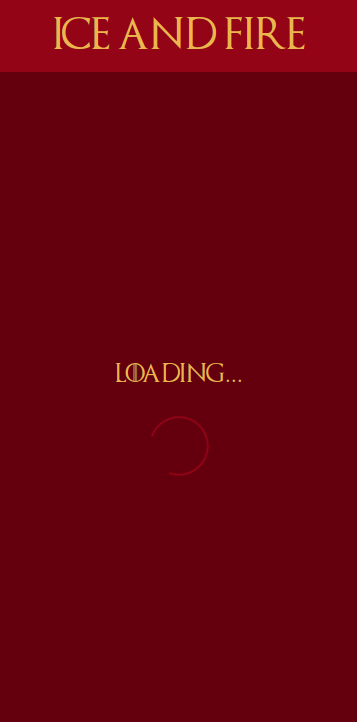
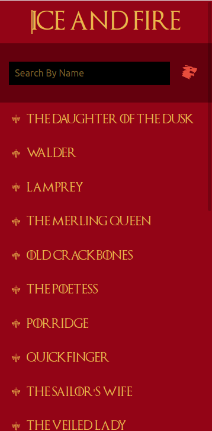
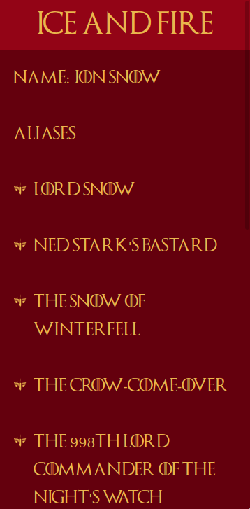

# Ice and Fire

A web application forged out of valerian steel, made by Edwin Moradian, first of his name.
More specifically, this web application serves as a hub for searching and finding information 
regarding Game of Thrones books, characters, or houses. It is built with React, Redux, and Styled components.

View the project [here](https://inspiring-mclean-269033.netlify.app).






### Installing

To install locally, just download the repo.

```bash 
$ git clone https://github.com/edwinmoradian90/ice-and-fire
```

Then install the neccessary dependencies.

```bash
$ npm install
```

Finally, run the development server. 

```bash
$ npm start
```

The default port is 3000.

## Running the tests

In the terminal, run the following:

```bash
$ npm test
```

## Built With

* [React](https://reactjs.org/docs/getting-started.html) - The web framework used
* [Redux](https://redux.js.org/introduction/getting-started) - State Management
* [Styled Components](https://styled-components.com/docs) - Used to style components

## Authors

**Edwin Moradian** [Github](https://github.com/edwinmoradian90) | [LinkedIn](https://linkedin.com/in/edwin-moradian) | [Portfolio](edwin-moradian.firebaseapp.com)

## License

This project is licensed under the MIT License - see the [LICENSE.md](LICENSE.md) file for details

## Acknowledgments

* [API of Ice and Fire](https://anapioficeandfire.com/Documentation)
